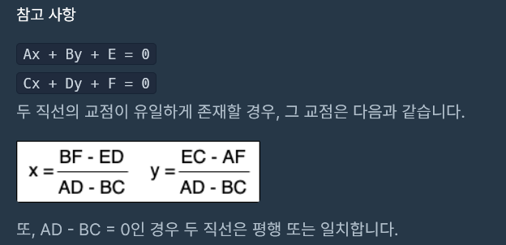

### 10주차_교점에 별 만들기 (실패한 문제)
___
- 모든 직선에 대해 서로의 2차방정식 해를 구함
- 해가 정수값인 좌표만 리스트에 추가
- 이후 배열을 만들어 좌표값에 해당하는 값을 1로 변경
- 문자열을 만들어서 좌표값이 1인 인덱스는 별로 치환

[링크](https://programmers.co.kr/learn/courses/30/lessons/87377)

__
## 문제점
- 2차방정식의 해를 구하는 공식을 사용해야하면 편하다.
- 나의 방적식의 해를 찾는 함수에서 파악하지 못한 문제가 있다. 

