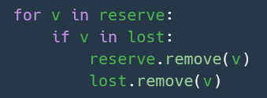
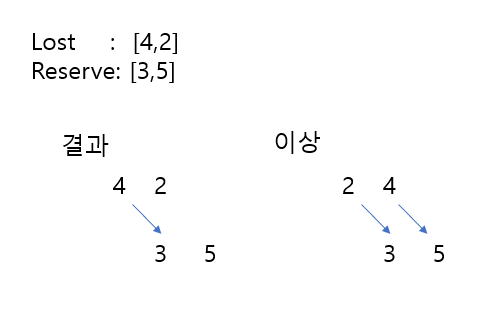

### 탐욕법-체육복
___

- 시간복잡도: O(N^2)

1. lost와 reserve 리스에서 각각 공통 원소를 제거한다.

2. lost와 reserve를 정렬한다.

3. lost의 원소 차례대로 reserve의 원소와 하나씩 비교하며 lost의 원소와 reserve 원소의 차이가 1이면 해당값을 reserve에서 제거하고 answer값을 1 증가시킨다

4. n - len(lost) + answer 값을 반환한다.

[링크](https://programmers.co.kr/learn/courses/30/lessons/42862?language=python3)

___
### 참고

- 공통 원소를 제거하는 과정에서 반복문안에서 리스트 원소를 삭제하면 버그 발생  

- 체육복을 빌려줄 때 순서를 고려하지 않으면 최적의 결과가 나오지 않음.  

